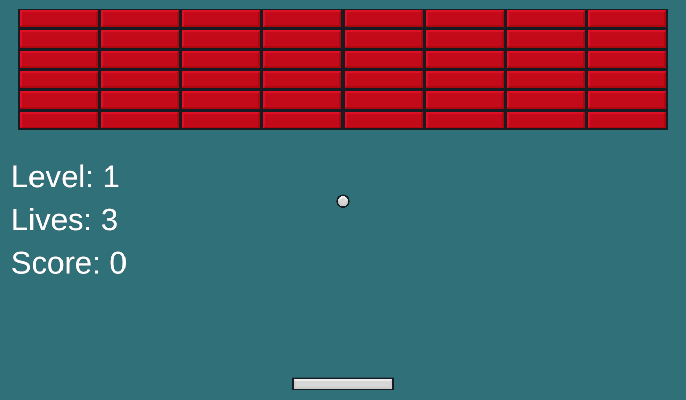
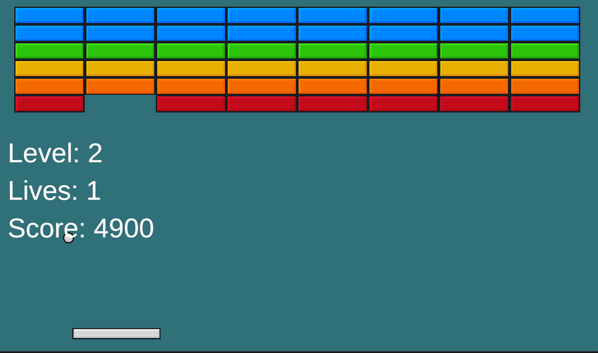
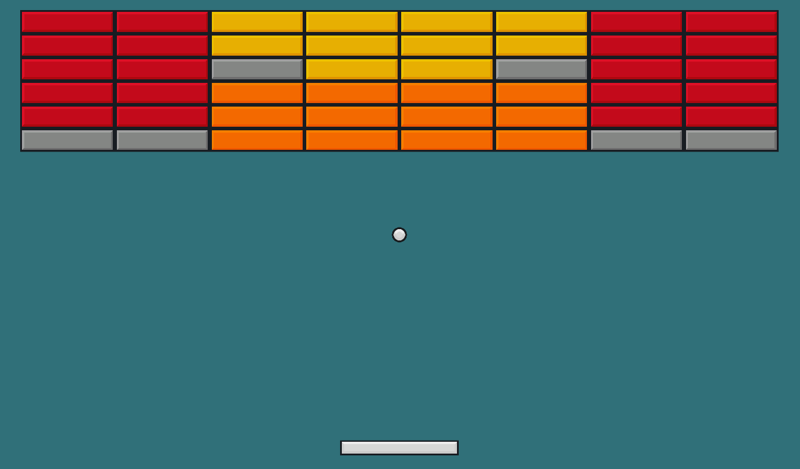
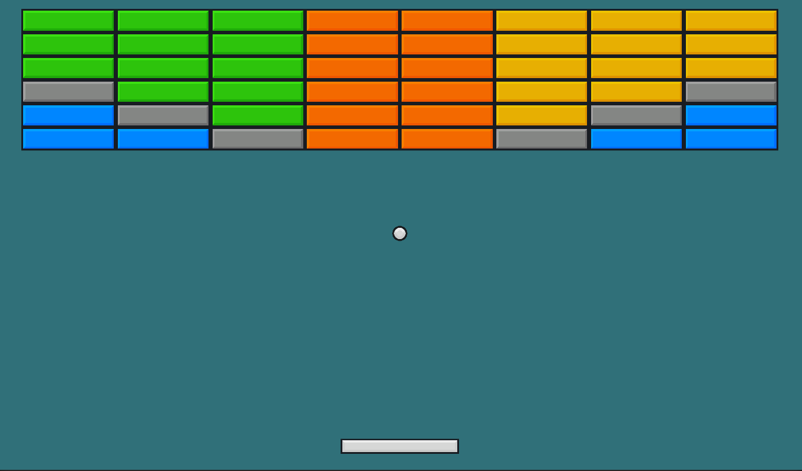
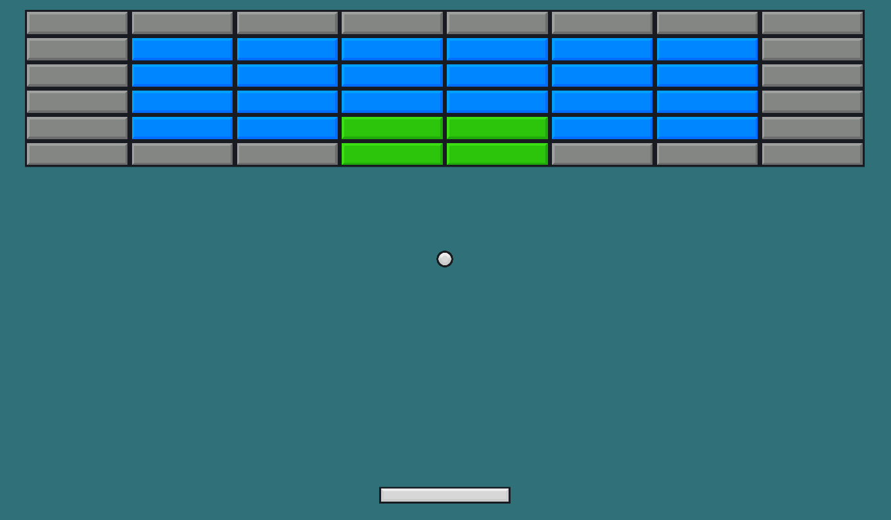

# Brick Breaker Game
## Project Overview
A classic brick breaker game built with Unity 2022.3.x (C#) for macOS, featuring Unity Physics Engine, precise collision detection, custom UI, sphere angle offset algorithm, and multi-level progression system.

## Quick Start
### Pre-built macOS Version
Download from GitHub Releases: [BrickBreaker_Mac_v1.0.0.zip](https://github.com/QIUWENJIN110/MyGameCodeCollection/releases/download/BrickBreaker/BrickBreaker_Mac_v1.0.0.zip)
*macOS 64-bit, no Unity environment required.*

### Run in Unity
1. Open the `BrickBreaker` project in Unity 2022.3.x (macOS recommended).
2. Open `Assets/Scenes/Global.unity` → Click "Play" to run.

### Build for macOS
1. `File > Build Settings` → Select "macOS (64-bit)".
2. Click "Build" to generate `BrickBreaker.app`.

## Core Features
- **Physics & Collision**: Unity Physics Engine + precise collision detection for ball/brick/paddle interaction.

- **Sphere Angle Offset Algorithm**: Dynamic rebound angles based on paddle impact position.  

- **Custom UI**: Real-time score/level display, macOS resolution adapted.  
    
  
- **Multi-level System**: Progressive difficulty with distinct brick layouts per level.
- **6-Tier Brick Difficulty**: Bricks categorized into 6 levels (Red → Orange → Yellow → Green → Blue → Gray) with increasing hardness; Gray bricks are unbreakable.
- 
    
  
  

## Game Controls (macOS)
- Paddle: ←/→ (or A/D)
