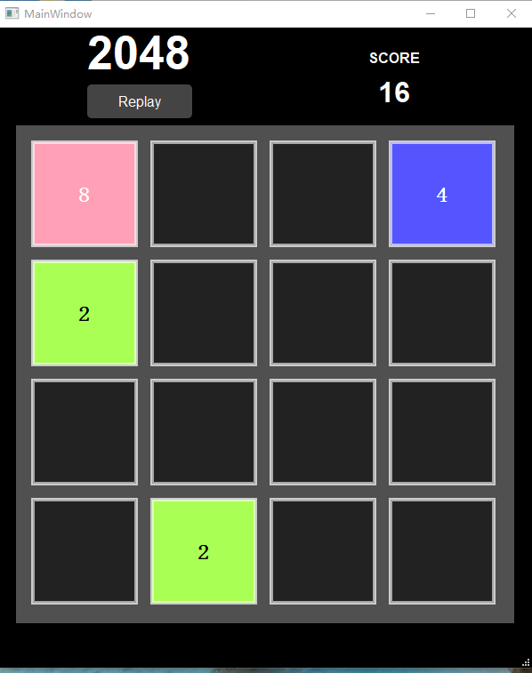
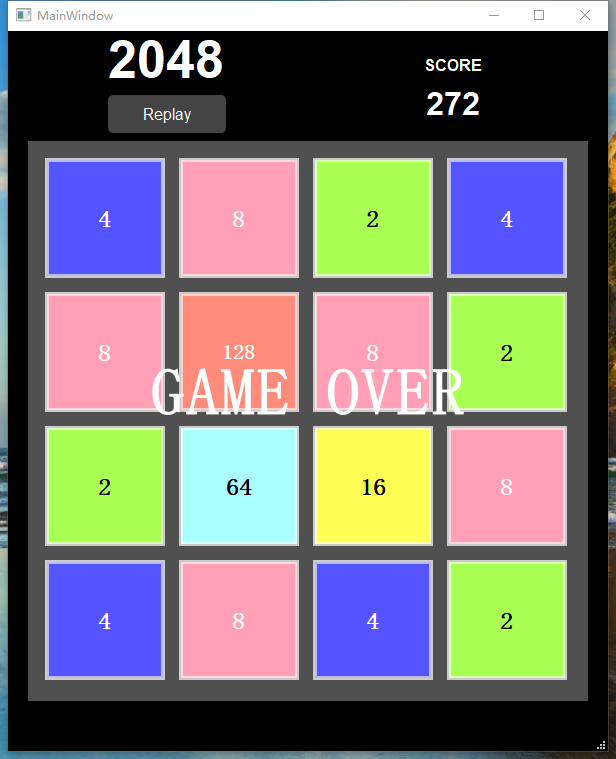
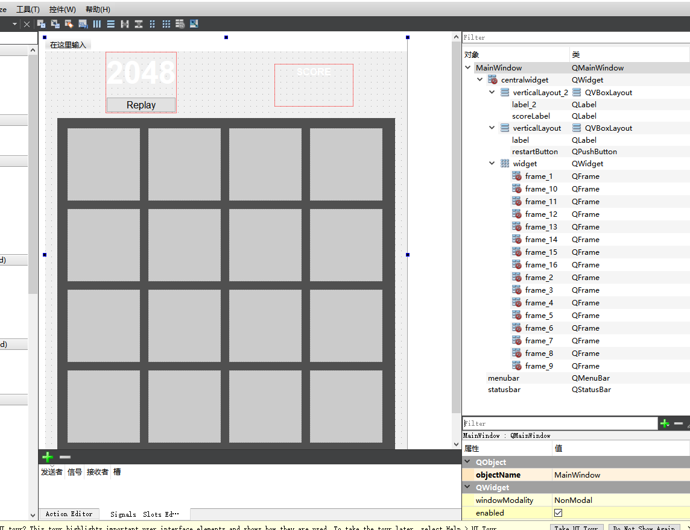

# 2048 Game
## Project Overview
A classic 2048 tile-merging puzzle game developed with Qt 5.14.2 (MSVC 2017 64-bit) in C++. The core gameplay involves sliding tiles up/down/left/right to merge identical-numbered bricks, with the goal of reaching target values such as 2048 or 4096. The project features optimized merge algorithms, immersive audio feedback, and a polished UI design for an intuitive gaming experience.

## Quick Start
### Download Executable
The pre-built executable (Windows 10/11 64-bit, no Qt environment required) is available in the GitHub Release package:  
[Game2048_Win64_v1.0.0.zip](https://github.com/QIUWENJIN110/MyGameCodeCollection/releases/download/Game2048/Game2048_Win64_v1.0.0.zip)  
*Compressed package includes: `2048Game.exe` (main program) + audio resources + all dependent DLLs (no additional Qt installation needed)*

### Demo Video
Watch the complete game gameplay demo: [GAME2048_Demo.mp4](demo/Game2048_Demo.mp4) (preview images below show core features)

## Core Features
- **Optimized Merge Algorithm**: Precise logic for tile movement and merging across all four directions, ensuring accurate combination of same-numbered bricks and numerical growth up to 2048/4096.  
  
  
  

- **Immersive Audio Feedback**: Integrated looping background music and interactive merge sound effects, triggering distinct audio cues when bricks merge to enhance game engagement.  

- **Custom UI Design**: Clean and intuitive interface layout with clear brick number display, real-time score statistics, and optimized visual experience for easy gameplay.  
  

## Development Environment
- Framework: Qt 5.14.2
- Compiler: MSVC 2017 64-bit
- Programming Language: C++
- Key Dependencies: Qt Multimedia (audio playback), Qt Widgets (UI rendering)

## Build from Source
1. Clone the repository to your local machine:  
   ```bash

   git clone https://github.com/你的用户名/你的仓库名.git
