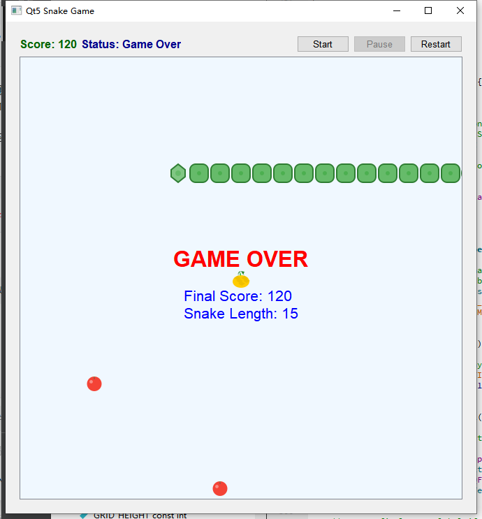
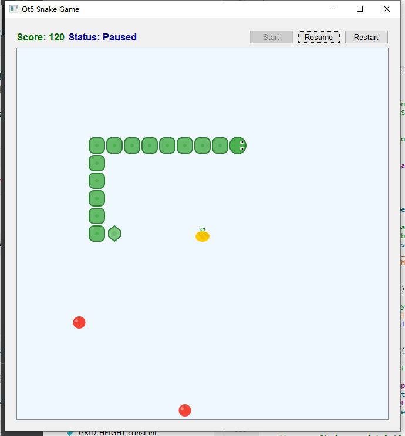
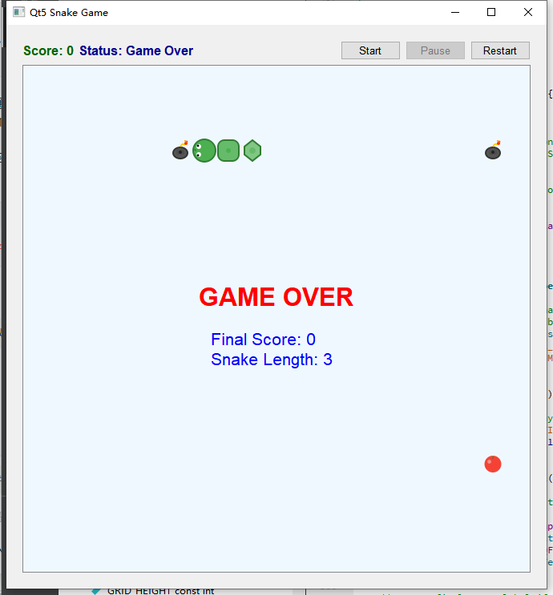

# Snake Game
## Project Overview
A classic Snake game implemented with Qt 5.14.2 (MSVC 2017 64-bit) in C++. This project integrates core game mechanics including collision detection algorithms, background music playback, and probabilistic item spawning (Apple: 60%, Bomb: 30%, Pineapple: 10%), delivering an enhanced and interactive retro gaming experience.

## Quick Start
### Download Executable
The pre-built executable (Windows 10/11 64-bit, no Qt environment required) is available in the GitHub Release package:  
[SnakeGame_Win64_v1.0.0.zip](https://github.com/QIUWENJIN110/MyGameCodeCollection/releases/download/SnakeGame/SnakeGame_Win64_v1.0.0.zip)  
*Compressed package includes: `SnakeGame.exe` (main program) + audio resources + all dependent DLLs (no additional Qt installation needed)*

### Demo Video
Watch the complete game gameplay demo: [SnakeGame_demo.mp4](demo/SnakeGame_demo.mp4) (preview images below show core features)

## Core Features
- **Precise Collision Detection**: Detects wall collisions, self-collisions, and item-snake collisions to trigger corresponding game logic (game over on wall/self collision, score/length changes on item pickup).  
  

- **Probabilistic Item Generation**: Dynamically spawns 3 types of items with predefined probabilities to add gameplay diversity:
  - Apple (60%): Increases snake length by 1 and score by 10
  - Bomb (30%): Triggers instant game over when the snake makes contact
  - Pineapple (10%): Increases snake length by 3 and score by 30 (prioritizes spawning at the grid center)  
   

- **Adaptive Movement Speed**: The snake’s movement speed gradually increases as its length grows (capped at a playable minimum threshold to avoid overly difficult gameplay), with background music playback rate synced to the game speed for immersive experience.  

- **Immersive Audio System**: Integrated looping background music and interactive sound effects (e.g., eating items, collision game over) to enrich auditory feedback and enhance game engagement.

## Development & Build
### Environment
- Framework: Qt 5.14.2
- Compiler: MSVC 2017 64-bit
- Programming Language: C++
- Key Dependencies: Qt Multimedia (audio playback), Qt Graphics View (2D rendering)

### Build from Source
1. Clone the repository to your local machine:  
   ```bash

   git clone https://github.com/QIUWENJIN110/MyGameCodeCollection.git

